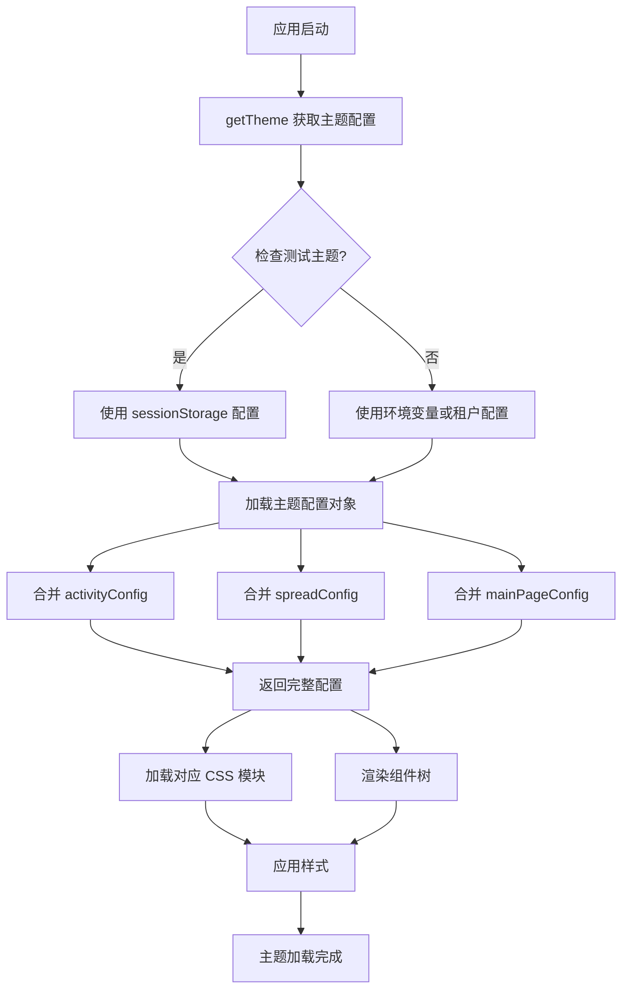

# 皮肤系统架构文档

[TOC]

## 概述

主项目的皮肤系统是一个高度可配置、模块化的主题管理方案，支持多达 37+ 套不同风格的皮肤。通过配置化的方式，可以灵活地定制组件样式、布局和交互行为。

## 目录结构

```bash
src/theme/
├── configuration/          # 主题配置目录
│   ├── default/           # 默认系列主题 (Theme #5-16)
│   ├── first/             # 第一系列主题 (Theme #1-3, #17-37)
│   ├── second/            # 第二系列主题 (Theme #4)
│   ├── pathMaps.ts        # 路径映射配置
│   └── theme-modifier.ts  # 主题配置修改器
├── modules/               # CSS 样式模块
│   ├── default/          # 默认系列样式
│   ├── first/            # 第一系列样式
│   └── second/           # 第二系列样式
├── templateConfigs/       # 模板配置
│   ├── mainPage.ts       # 首页功能配置
│   ├── spread.ts         # 推广页配置
│   └── activityConfig.ts # 活动配置
├── imgConfigs/           # 图片资源配置
│   └── index.ts          # 图片映射索引
├── news/                 # 新闻主题样式
├── hooks.ts              # 主题钩子与核心逻辑
└── variables.css         # 全局 CSS 变量
```

## 核心模块

### 1. 主题配置中心 (`hooks.ts`)

#### 1.1 主题配置对象

```typescript
interface ThemeConfig {
  skin: string              // 皮肤系列：'default' | 'first' | 'second'
  theme: string             // 主题名称：如 'blue-default', 'neo-blue'
  home?: string             // 首页版本：'v01', 'v02'
  color: string             // 主色调
  newSkin?: string          // 新皮肤标识
  configuration?: any       // 主题配置对象
  specialSkinSettings?: any // 特殊皮肤设置
  skinNumber?: string       // 皮肤编号：'Theme #1' - 'Theme #37'
  homeType?: string         // 首页类型：'GameType' | 'Platform'
  homeTypeList?: string[]   // 支持的首页类型列表
  activityConfig?: object   // 活动配置
  spreadConfig?: object     // 推广页配置
}
```

#### 1.2 主题映射表

主题配置映射表 `themeConfig` 包含所有可用主题：

**旧版本兼容**
- `H5Dark:DarkGreen` - Legacy Dark Green
- `H5Dark:GoldenYellow` - Legacy Golden Yellow
- `H5Dark:BluePurple` - Legacy Blue Purple

**新版本主题** (37 套)
- `Layout2:DarkGreen` - Theme #1
- `Layout2:GoldenYellow` - Theme #2
- ...
- `Theme37` - Theme #37

#### 1.3 核心方法

```typescript
/**
 * 获取当前配置主题
 * @param from - 'router' | 'template'
 * @returns 完整的主题配置对象
 */
function getTheme(from: 'router' | 'template' = 'template')
```

**功能特性：**
- 支持测试主题配置（通过 sessionStorage）
- 自动合并活动配置、推广配置、主页配置
- 支持动态切换 homeType

---

### 2. 主题配置修改器 (`theme-modifier.ts`)

用于基于现有主题创建变体的工具类。

#### 2.1 核心 API

| 方法 | 描述 | 示例 |
|------|------|------|
| `modify()` | 修改组件属性 | `.modify('tabbar_inicio_Ranking', 'imageList[0].id', 3)` |
| `batchModify()` | 批量修改配置 | `.batchModify([{component: '...', property: '...', value: ...}])` |
| `modifyPath()` | 通过路径修改 | `.modifyPath('main.style.padding', '0 1rem')` |
| `modifyComponent()` | 替换整个组件 | `.modifyComponent('tabbar_inicio_Ranking', {...})` |
| `findAndModify()` | 条件查找修改 | `.findAndModify(finder, modifier)` |
| `getComponent()` | 获取组件配置 | `.getComponent('tabbar_inicio_Ranking', componentId)` |
| `build()` | 构建最终配置 | `.build()` |

#### 2.2 使用示例

```typescript
import { createThemeModifier } from './theme-modifier';
import goldshinGreenConfig from './first/goldshine-green';

// 创建新主题变体
const stellarDuskConfig = createThemeModifier(goldshinGreenConfig)
  .modify('tabbar_inicio_Ranking', 'imageList[0].id', 3)
  .modify('navbar_top_Inicio', 'style.height', '3.5rem')
  .build();

// 批量修改
const customTheme = createThemeModifier(goldshinGreenConfig)
  .batchModify([
    { component: 'tabbar_inicio_Ranking', property: 'imageList[0].id', value: 3 },
    { component: 'tabbar_tabBar', componentId: 2, property: 'imageList[0].id', value: 3 },
    { path: 'main.style.backgroundColor', value: '#1a1b26' }
  ])
  .build();
```

---

### 3. 图片资源配置 (`imgConfigs/index.ts`)

统一管理所有组件的图片资源和图标映射。

#### 3.1 配置结构

```typescript
{
  [组件名称]: {
    [版本号]: () => import('组件路径'),  // 组件导入
    icon1: {                             // 图标资源
      [变体ID]: 图片URL或函数
    },
    icon2: {...},
    // ...
  }
}
```

#### 3.2 特色功能

**平台图标雪碧图定位**
```typescript
platformImagePosition: Record<string, string> = {
  slots_cq9: 'background-position: 0 0',
  Tada: 'background-position: -100% 0',
  PP: 'background-position: -200% 0',
  // ...
}
```

**分类图标映射**
```typescript
categoryImagePosition: Record<string, string> = {
  ONE_API_HOT: 'background-position: 0 0',
  ELECTRONIC: 'background-position: -100% 0',
  // ...
}
```

**动态图片加载**
```typescript
icon1: {
  1: (key: PlatformType) => {
    const position = platformImagePosition[key]
    if (position) {
      const imageUrl = new URL('@/assets/img/inicio/platform1.png', import.meta.url)
      return `background-image: url(${imageUrl.href});${position}`
    }
    return ''
  }
}
```

---

### 4. 模板配置系统

#### 4.1 主页模板配置 (`templateConfigs/mainPage.ts`)

配置首页功能模板。

```typescript
type MainPageFeatures = 'RegisterReward';

type MainPageConfig = Partial<Record<MainPageFeatures, { template: string }>>;

// 主题与模板映射
const themeTemplateMap: Record<string, string> = {
  PhantomBlue: 'style_17',
  NeoBlue: 'style_18',
  RoyalAmethyst: 'style_18',
  // ...
};

// 导出配置
export const mainPageTemplateConfig: Record<string, MainPageConfig>
```

#### 4.2 推广页配置 (`templateConfigs/spread.ts`)

定义推广页各子页面的模板样式。

```typescript
type SpreadSubPageNames = {
  Index: string           // 推广首页
  Detail: string          // 详情页
  Subordinate: string     // 下级页面
  Commission: string      // 佣金页面
  Team: string            // 团队页面
  // ...
}

type SpreadSubPageConfig = {
  [key in keyof SpreadSubPageNames]: { template: string }
}
```

#### 4.3 活动配置 (`templateConfigs/activityConfig.ts`)

管理各活动页面的模板样式（具体实现需查看源码）。

---

### 5. 主题配置详解

每个主题配置文件导出两部分：

#### 5.1 `specialSkinSettings`

特殊皮肤设置，包含该主题独有的配置项。

```typescript
export const specialSkinSettings = {
  hotGameOptions: {
    logo1: getImageUrl('icons/hot-27.svg'),
  },
  gameSearchProps: {
    cardSize: 3
  }
}
```

#### 5.2 主配置对象

基于组件树结构的配置：

```typescript
export default {
  main: {
    children: [
      {
        position: 'tabs',      // 位置标识
        children: [
          {
            componentName: 'tabbar_tabBar',
            componentId: 1,
            layoutType: 'layout37',
            style: {
              '--tab-bar-height': '4.125rem',
            },
            children: [...]
          }
        ]
      },
      {
        position: 'other',
        children: [...]
      }
    ]
  },
  inicio: {
    children: [
      {
        position: 'header',
        children: [...]
      },
      {
        position: 'content',
        children: [...]
      }
    ]
  }
}
```

**组件配置属性：**
- `componentName` - 组件名称（对应 imgConfigs 中的键）
- `componentId` - 组件版本 ID
- `layoutType` - 布局类型标识
- `style` - CSS 样式对象（支持 CSS 变量）
- `imageList` - 图片资源列表
- `children` - 子组件配置数组
- `position` - 位置标识符

---

### 6. CSS 样式模块 (`modules/`)

#### 6.1 目录结构

```
modules/
├── default/
│   ├── blue-default.css
│   ├── green-default.css
│   ├── amber-purple.css
│   └── ...
├── first/
│   ├── neo-blue.css
│   ├── phantom-blue.css
│   ├── theme-37.css
│   └── ...
└── second/
    └── amber-purple.css
```

#### 6.2 CSS 变量系统 (`variables.css`)

全局 CSS 变量定义：

```css
:root {
  /* Ionic Color Variables */
  --ion-color-primary: #3880FF;
  --ion-color-primary-rgb: 56, 128, 255;
  --ion-color-primary-contrast: #ffffff;

  /* 自定义主题变量 */
  --ep-color-background-fill-body-default: ...;
  --ep-color-text-brand-primary: ...;
  --ep-border-radius-m: ...;
  --ep-font-size-xl: ...;
  /* ... */
}
```

---

## 主题系列分类

### Default 系列 (Theme #5-16)

| 编号 | 标识 | 主题色 | 首页类型 |
|------|------|--------|---------|
| #5 | Layout1:Blue | #090F1F | GameType |
| #6 | Layout1:Green | #2B4F14 | GameType |
| #7 | Layout1:BlueV01 | #090F1F | Platform |
| ... | ... | ... | ... |
| #16 | Layout1:AuroraYellow | #24221F | Platform |

**特点：**
- 使用 `default` 皮肤系列
- 支持 v01、v02 等首页版本
- 配置相对简洁

### First 系列 (Theme #1-3, #17-37)

| 编号 | 标识 | 主题色 | 首页类型 |
|------|------|--------|---------|
| #1 | Layout2:DarkGreen | #22262E | GameType |
| #2 | Layout2:GoldenYellow | #262624 | GameType |
| #3 | Layout2:BluePurple | #6526db | GameType |
| #17 | Layout2:PhantomBlue | #1a1f30 | Platform |
| #18 | Layout2:NeoBlue | #1d2a55 | Platform/GameType |
| ... | ... | ... | ... |
| #37 | Theme37 | #5B2875 | Platform |

**特点：**
- 使用 `first` 皮肤系列
- 大多数带有 `newSkin` 标识
- 配置更加复杂和灵活
- 支持更多自定义组件

### Second 系列 (Theme #4)

| 编号 | 标识 | 主题色 | 首页类型 |
|------|------|--------|---------|
| #4 | Layout3:AmberPurple | #262346 | GameType |

**特点：**
- 使用 `second` 皮肤系列
- 独特的 Layout3 布局

---

## 工作流程



---

## 开发指南

### 创建新主题

#### 方法 1: 基于现有主题修改

```typescript
// 1. 选择基础主题
import baseTheme from './first/neo-blue';
import { createThemeModifier } from './theme-modifier';

// 2. 使用修改器创建变体
export const specialSkinSettings = {
  // 特殊设置...
};

export default createThemeModifier(baseTheme)
  .batchModify([
    { component: 'tabbar_inicio_Ranking', property: 'imageList[0].id', value: 3 },
    { component: 'navbar_top_Inicio', property: 'style.height', value: '3.5rem' },
    { path: 'main.style.backgroundColor', value: '#1a1b26' }
  ])
  .build();
```

#### 方法 2: 完全自定义

```typescript
// 1. 创建配置文件 theme-38.ts
export const specialSkinSettings = {
  hotGameOptions: {
    logo1: getImageUrl('icons/hot-38.svg'),
  }
};

export default {
  main: {
    children: [
      // 完整的组件树配置...
    ]
  },
  inicio: {
    children: [
      // 完整的组件树配置...
    ]
  }
};

// 2. 在 hooks.ts 中注册
import firstTheme38 from '@/theme/configuration/first/theme-38';

export const themeConfig: Record<string, ThemeConfig> = {
  // ...
  'Theme38': {
    skin: 'first',
    theme: 'theme-38',
    color: '#123456',
    newSkin: 'new-skin-symbol',
    configuration: firstTheme38,
    specialSkinSettings: firstTheme38.specialSkinSettings,
    skinNumber: 'Theme #38',
    homeType: 'Platform'
  }
};

// 3. 创建对应 CSS 文件
// src/theme/modules/first/theme-38.css

// 4. 更新 imgConfigs 添加资源映射
```

### 主题测试

在浏览器控制台中：

```javascript
// 切换到测试主题
sessionStorage.setItem('testtheme', JSON.stringify({
  themeKey: 'Theme37',
  homeType: 'Platform'
}));

// 清除测试配置
sessionStorage.removeItem('testtheme');

// 刷新页面生效
location.reload();
```

---

## 最佳实践

### 1. 组件复用

优先使用已有组件配置，通过修改器进行微调：

```typescript
// ✅ 推荐
const newTheme = createThemeModifier(existingTheme)
  .modify('componentName', 'property', newValue)
  .build();

// ❌ 避免
const newTheme = {
  // 重复编写大量配置...
};
```

### 2. CSS 变量优先

使用 CSS 变量而非硬编码值：

```typescript
// ✅ 推荐
style: {
  '--tab-bar-height': '4.125rem',
  'background': 'var(--ep-color-background-fill-surface-raised-L1)'
}

// ❌ 避免
style: {
  height: '66px',
  background: '#1a1b26'
}
```

### 3. 图片资源管理

使用 `getImageUrl` 工具函数：

```typescript
// ✅ 推荐
imageList: [{
  name: 'icon1',
  id: 37  // 引用 imgConfigs 中定义的 ID
}]

// ❌ 避免
imageList: [{
  url: '/assets/img/inicio/icon.png'  // 硬编码路径
}]
```

### 4. 模块化组织

将相关配置分组：

```typescript
// ✅ 推荐
const headerConfig = {
  componentName: 'tabbar_layout_toolbar',
  children: [/* ... */]
};

const contentConfig = {
  componentName: 'tabbar_inicio_SwiperView',
  children: [/* ... */]
};

export default {
  inicio: {
    children: [
      { position: 'header', children: [headerConfig] },
      { position: 'content', children: [contentConfig] }
    ]
  }
};
```

---

## 常见问题

### Q: 如何快速找到某个组件的配置位置？

使用 `getComponent` 方法：

```typescript
const modifier = createThemeModifier(currentTheme);
const component = modifier.getComponent('tabbar_inicio_Ranking', 1);
console.log('组件配置:', component);
```

### Q: 主题配置中的 componentId 有什么作用？

`componentId` 用于区分同一组件的不同版本实现：

```typescript
{
  componentName: 'tabbar_tabBar',
  componentId: 1,  // 使用版本 1 的 tabBar 组件
  // ...
}
```

在 `imgConfigs/index.ts` 中对应：

```typescript
tabbar_tabBar: {
  1: () => import('@/views/tabbar/components/tabBar/components/colorWrap/index.vue'),
  2: () => import('@/views/tabbar/components/tabBar/components/imageWrap/index.vue'),
  // ...
}
```

### Q: layoutType 的作用是什么？

`layoutType` 用于标识组件使用的特定布局样式：

```typescript
{
  componentName: 'tabbar_tabBar',
  layoutType: 'layout37',  // 组件会应用 layout37 对应的样式
  // ...
}
```

### Q: 如何调试主题配置？

```typescript
// 1. 获取当前主题
const currentTheme = getTheme('template');
console.log('当前主题配置:', currentTheme);

// 2. 查看组件树
console.log('首页配置:', currentTheme.configuration.inicio);

// 3. 检查特殊设置
console.log('特殊设置:', currentTheme.specialSkinSettings);
```

---

## 性能优化建议

### 1. 按需加载组件

组件使用动态导入：

```typescript
{
  1: () => import('@/components/BonusPool/index.vue'),
  2: () => import('@/components/BonusPool/2/index.vue'),
}
```

### 2. 图片资源优化

- 使用雪碧图（Sprite）减少 HTTP 请求
- WebP 格式优先
- 懒加载非首屏图片

### 3. CSS 模块按需引入

根据当前主题只加载对应的 CSS 文件。

---

## 版本历史

| 版本 | 更新内容 | 日期 |
|------|---------|------|
| v3.0 | 新增 Theme #37，支持 layout37 布局 | 2026-01 |
| v2.5 | 新增 Theme #30-36 | 2025-12 |
| v2.0 | 重构主题系统，引入 theme-modifier | 2025-10 |
| v1.5 | 新增 First 系列主题 | 2025-08 |
| v1.0 | 初始版本，支持 Default 系列 | 2025-06 |

---

## 相关链接

- [Milo-Lowcode 项目](../../milo-lowcode/)
- [主题配置示例](./configuration/first/)
- [组件库文档](../../components/)
- [API 文档](../../api/)

---

**文档维护：** 开发团队
**最后更新：** 2026-01-29
**文档版本：** v3.0
